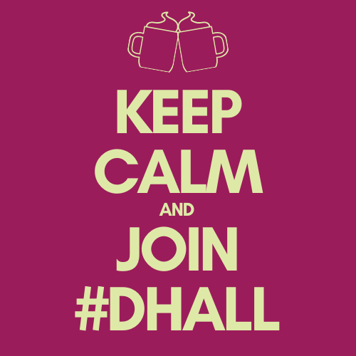

# Ein Ort für die DH-Community

#DHall ist ein virtueller Treffpunkt, an dem sich Personen aus der DH-Community online zusammenfinden können. Dafür steht ein [Discord](https://discord.com/)-Server bereit. Es gibt darin diverse Chat- und Voice-Kanäle mit thematischen, regionalen oder anderen Vorzeichen. Mehr über die Hintergründe [hier](about).

## Features

* über 400 Mitglieder
* über 30 Channels
* sehr nette Admins (s.u.)
* Teeküche und Lernraum
* freie Getränke
* good vibes

## Mitmachen

Folge dem aktuellen Einladungs-Link zum Discord-Server: [https://discord.gg/84nxSXx6T8](https://discord.gg/84nxSXx6T8)

## Admins A-Z

Benjamin Auberer 👑*, Berenike Rensinghoff, Daniel Brenn, Lea Gleißner, Lisa Kolodzie, Melanie Seltmann, Torsten Roeder

_*) Gründerkrone_

